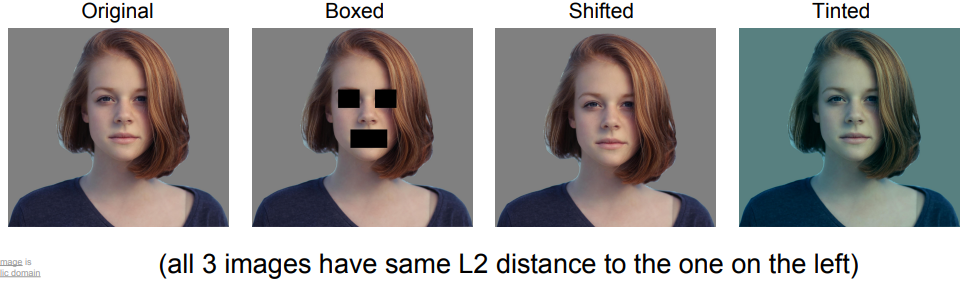
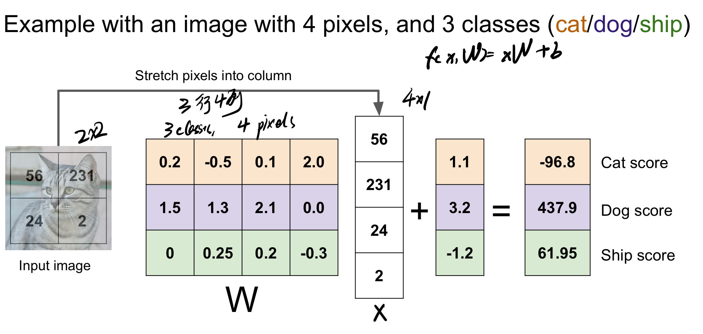

# Image Classification

## 什么叫分类算法

分类任务: 给出一张图片->给出对应的标签

面临的问题:

* 计算机看到的具体来说不是一张图片, 而是一个像素矩阵(比如说800*600*3), *如何把图片和其像素矩阵联系起来是个问题*
* Viewpoint variation, 移动相机, 图片的角度会有所改变, 矩阵中的像素点会随之改变
* Illumination
* Deformation, 图片中的物体会有不同程度的形变, 但本质上还是一个物体, *比如猫*
* Occlusion, 遮挡
* etc....

## Data-Driven

视觉算法不能像排序算法一样硬编码, 没有一个标准的处理流程, 所以把数据丢给计算机, 让计算机自己去学习是最合适的一种选择

* 寻找图片集
* 人工分类 -> 数据标注
* 丢给机器 -> 训练数据集 => 找出合适的`classifier`
* 用训练好的`classifier`去预测新的图片

### 最简单的classififer, Nearest Neighbor

`train`: 读取并存储所有`data`和`labels`

```python
def train(images, labels):
    # Training
    return model
```

`predict`: 拿到新图片后, 观察新图片与哪些图片相似, 然后返回*最相似图片*的标签

```python
def predict(model, test_images):
    # Use model to predict labels
    return test_labels
```

具体的`classifier`代码如下

```python
import numpy as np


class NearestNeighbor:
    def __init__(self):
        pass

    def train(self, X, y):
        """
        X is N * D where each row is an example. Y is 1-dimensional array of size N.
        """
        self.Xtr = X
        self.ytr = y

    def predict(self, X):
        """
        X is N * D where each row is an example we wish to predict
        """
        num_test = X.shape[0]
        # make sure the output type is the same as the input
        Ypred = np.zeros(num_test, dtype=self.ytr.dtype)
        # loop over all test rows
        for i in range(num_test):
            # find the nearest training image to the i'th test image
            # using the L1 distance
            distances = np.sum(np.abs(self.Xtr - X[i, :]), axis=1)
            # get the index with the smallest distance
            min_index = np.argmin(distances)
            Ypred = self.ytr[min_index]
        return Ypred
```

* `train`函数, 训练只存储, 时间复杂度为`O(1)`
* `predict`函数, 使用L1距离, 计算出最相似图片的标签, 时间复杂度为`O(N)`
* 时间复杂度不好, 一般来说训练时间可以比较长, 但预测时间要相对较短, `Nearest Neighbor`算法正好相反

## 改进, KNN算法

刚才的`Nearest Neighbor`算法, 找的是最近, 即K=1; 如果K>1, 说不定效果会更好(**找最近的K个点**)

### 如何判定近的这个概念


如何判断两点是否属于一个`classification`?

最简单的就是使用上面这两种计算距离, 曼哈顿距离和欧几里得距离, 两个计算方式的选定与具体区别要看实际的使用场景;
如果`input vector`是没有太大意义的, 就可以使用欧几里得距离, 因为欧几里得上任意一点距离*中点*的distance是相同的,
而曼哈顿距离合适那些`input vector`有一定意义的情况

Ex: 比如`NLP`中, 比较两段文字是否属于一个意思, 就可以分别算出连两段文字的距离

### Hyperparameter, 超参数

超参数: 指那些不能从训练中主动学习, 调整, 修改, 但又确实能够影响实际训练效果的参数, 比如`KNN`算法中的K, 还有距离算法

#### 如何选定超参数


1. 直接在`train`数据集中选定一个效果最好的超参数 => **不好! 容易严重过拟合**
2. 分割数据集 -> `train/test`, 先在`train`数据集中选定一个效果最好的超参数, 然后用这个超参数在`test`数据集上测试效果 => 不好, 因为这样不清楚选定的超参数在新数据集中的表现
3. 分割数据集 -> `train/val/test`, 先在`train`中训练出超参, 然后把找好的超参在`val`数据集中进行验证, 找到最好的一个, 并用在`test`中使用 => **MUCH BETTER!!!**

### KNN算法的缺点

`KNN`算法不适合在图像问题上使用, 原因在于

1. 训练速度比较快, 但预测速度太慢了,时间复杂度上不符合
2. 计算矩阵中的像素点间的距离毫无意义'
3. 维度诅咒

对于第二点, 比如说, 后三张图片要么有遮挡, 要么有偏移, 要么染色; 即使图片发生了变化, 但是`KNN`这种简单计算距离的方式很可能分不出图片的不同



对于第三点, `KNN`算法喜欢在目标点周围存在比较稠密的数据点, 但数据稠密需要增加维度, 但增加维度的话又不好计算距离


## Linear Classification

多个线性分类器相结合 => 神经网络


参数说明:

* `x`: 图片的像素矩阵
* `W`: 权重矩阵
* `b`: 偏移项, 比如说数据集中猫的图片比狗的要多, 那
  $$
  b_猫 > b_狗
  $$

1. 图像像素矩阵与权重相结合
2. 算出分数(1*10矩阵)
3. 猫的分数最大
4. 这个图像里面是猫

这里有一个`bias trick`, 作用如下, 把权重W和偏移量b合二为一

$$
f(x, W) = Wx + b => f(x, W) = Wx
$$


因为`W.shape[1]`与`b.shape[0]`是一样的, 所以可以将`W`和`b`合并成一个矩阵, 而`x`再加一个维度(default 1)



过程解释:

1. 输入的照片是一个简单的2*2矩阵, 转换成4*1的转置矩阵
2. 权限矩阵, 因为输入的图片shape为4, 图片一共有3类, 所以权限矩阵为3*4
   1. 权限矩阵的每一行都是一个类别的分类器

### Linear Classification的问题


解释说明:

最下面的一路图是根据原数据集中不同类生成的对应分类器, 可以看到一个`linear classifier`一次只能学习每个类别的一个模板;
如果每个类别有多个模板, 但只能求取所有变体的平均值

最佳的解决办法就是NEURAL NETWORK => BETTER ACCURACY, 没有一个类别只有一个模板的限制


上述的三个图, 无法通过线性分类器(一条直线)去直接分类, 这是线性分类器的**死穴**
