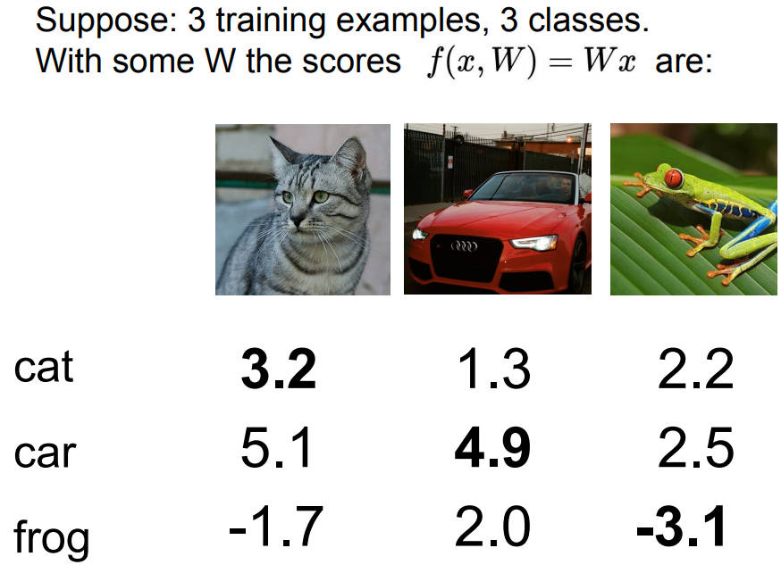

# Loss Functions and Optimization

## 什么是损失函数, 它是干什么用的

书接上回的`linear classifier`, 当使用其计算出每个图片在各个分类的对应分数时, 有可能会发生问题


即分数最高代表的预测结果和实际的分类可能是不一样, 而这个时候我们想到的必然是调整权重$W$

但如何选取一个合适的$W$从而得到满意的预测结果, 这就需要`loss function`, 即*损失函数*来对$W$进行修正

损失函数以$W$为输入, 最终输出一个指标, 而这个指标用来衡量$W$是好, 还是坏?

而所谓的*优化*, 其实就是从一群$W$中挑选一个不太坏的$W$

所以说, 损失函数就是告诉我们, 现在选出来的*分类器*到底有多好/多糟

比如说, $\left\{\left(x_i, y_i\right)\right\}_{i=1}^N$, 其中$N$代表N张图片集, $x_i$表示第i张图片的像素矩阵, 而$y_i$表示第i张图片的分类标签

损失函数范例: $L=\frac{1}{N} \sum_i L_i\left(f\left(x_i, W\right), y_i\right)$ 实际含义: 预测的label分数与实际label分数之间的差距

### Multiclass SVM loss

shorthand for the scores vector: $s = f(x_i, W)$

$\begin{aligned} L_i & =\sum_{j \neq y_i} \begin{cases}0 & \text { if } s_{y_i} \geq s_j+1 \\ s_j-s_{y_i}+1 & \text { otherwise }\end{cases} \\ & =\sum_{j \neq y_i} \max \left(0, s_j-s_{y_i}+1\right)\end{aligned}$

参数解释

* $s$: 通过分类器预测出来的label分数
* 下标$yi$: 该样本正确的label
* $s_{yi}$: 该样本预测正确时的label分数

SVM损失函数讲究的就是一个, 拉开预测正确和错误的距离, 至少为1($s_{yi}\geq s_j + 1$的由来)


实际计算



猫的损失: $L_i=\sum_{j \neq y_i} \max \left(0, s_j-s_{y_i}+1\right) = max(0,5.1-3.2+1) + max(0,-1.7-3.2+1)=2.9$
汽车的损失: $L_i=\sum_{j \neq y_i} \max \left(0, s_j-s_{y_i}+1\right) = max(0,1.3-4.9+1) + max(0,2.0-4.9+1)=0$
青蛙的损失: $L_i=\sum_{j \neq y_i} \max \left(0, s_j-s_{y_i}+1\right) = max(0,2.2-(-3.1)+1) + max(0,2.5-(-3.1)+1)=12.9$

总损失为: $L=\frac{1}{N}\sum_{i=1}^N L_i=\frac{2.9+0+12.9}{3}=5.27$

这里如果我们对损失函数进行一个平方处理: $L_i=\sum_{j \neq y_i} \max \left(0, s_j-s_{y_i}+1\right) => L_i=\sum_{j \neq y_i} \max \left(0, s_j-s_{y_i}+1\right)^2$

最大的变化就是: 让坏变得越坏, $坏=>坏^2$

伪代码

```python
def L_i_vectorized(x, y, W):
    # Wx = Ypred
    scores = W.dot(x)
    # SVM loss function
    margins = np.maximum(0, scores - scores[y] + 1)
    # y代表正确的, 正确-正确=0
    margins[y] = 0
    loss_i = np.sum(margins)
    return loss_i
```

## 正则化

$L=\frac{1}{N} \sum_i L_i\left(f\left(x_i, W\right), y_i\right)$拿到这么一个损失函数, 去选取一个合适的分类器, 分类器最终是要在*测试集*中起作用, 我们不在乎分类器在*训练集*上的效果, 只在乎分类器在*测试集*上的效果


如果只是一味的追求在训练集中找到最好的$W$, 并最终作用于训练集, 就会像蓝色曲线一样, 产生过拟合的效果; 而我们实际上想要的是绿色直线

这就是为什么我们要引入正则化, 对损失函数进行修正

$L(W)=\frac{1}{N} \sum_{i=1}^N L_i\left(f\left(x_i, W\right), y_i\right)+\lambda R(W)$

$\lambda R(W)$就是所说的正则项, 而这里的$\lambda$是超参数

### Occam's Razor

引入正则项来防止过拟合符合奥卡姆剃刀原则, keeping it simpler as possible

$\lambda, R, W$三者的关系

总的来说, $\lambda, R$是让蓝线变成绿线, $\lambda$算是一种penalty, 来降低算法的复杂度

$\begin{array}{ll}\mathrm{L} 2 \text { regularization } & R(W)=\sum_k \sum_l W_{k, l}^2, \\ \mathrm{~L} 1 \text { regularization } & R(W)=\sum_k \sum_l\left|W_{k, l}\right|\end{array}$

### Softmax Classifier - Multinomial Logistic Regression

SVM预测出来的分数并没有赋予实际更多的意义

$\left.\begin{array}{|l|l}\hline P\left(Y=k \mid X=x_i\right)=\frac{e^{s_k}}{\sum_j e^{s_j}} \quad \text { where } \quad s=f\left(x_i ; W\right) \\ L_i=-\log P\left(Y=y_i \mid X=x_i\right)\end{array}\right\} \quad L_i=-\log \left(\frac{e^{s y_i}}{\sum_j e^{s_j}}\right)$

其中$P\left(Y=k \mid X=x_i\right)=\frac{e^{s_k}}{\sum_j e^{s_j}}$的作用是概率分布, 使最终的值位于$[0,1]$之间, 并且总和正好等于1


理论上$L_i \in [0, \infty]$

## SVM vs. Softmax


* SVM: 只要正确分类的得分比错误分类的得分高出一个等级($\geq 1$), **SVM要的是越过threshold**
* Softmax: 如果正确分类得分越高, 则概率越大, 最极端的情况下, 正确的概率$+\infty$, 错误的概率$-\infty$, **Softmax要的是让好的越好, 坏的越坏**

## Optimization

### 梯度与梯度下降

**偏导数 partial derivative**
$f(x, y) = x^2 + y^2$

1. treat `x` as a constant: $f_x(x, y) = \frac {\partial{f}}{\partial{x}} = 2x$
2. treat `y` as a constant: $f_y(x, y) = \frac {\partial{f}}{\partial{y}} = 2y$

对于多变量的函数，计算起来很麻烦，梯度将所有偏导数压缩成一个向量，用于方便计算

$f(x, y) = x^2 + y^2$
$f_x(x, y) = \frac {\partial{f}}{\partial{x}} = 2x$
$f_y(x, y) = \frac {\partial{f}}{\partial{y}} = 2y$
Gradient: $\left[\begin{matrix} 2x\\ 2y \end{matrix} \right] \Rightarrow \bigtriangledown f = \left[\begin{matrix} \frac {\partial f}{\partial x}\\ \frac {\partial f}{\partial y} \end{matrix} \right]$


**梯度下降 Gradient Descent**


梯度下降，一步步的逼近到`local minimum`

关于`learning rate` $\alpha$, 如果选的过大，则很容易跳过`local minimum`; 如果选的过小，则迭代的次数会过多

这个学习率$\alpha$, 也是一个重要的**超参数**

Gradient descent也不是没有缺点，在一个区间内寻找单一的`local minimum`不难，但是很难去找`global minimum`

* 增长方向: $\bigtriangledown f$
* 降低方向: $- \bigtriangledown f$
* Update position: $(x_1, y_1) = (x_0, y_0) - \alpha \bigtriangledown f$
  * Example: $T = f(x, y) = 85 - \frac {1}{90} x^2(x - 6)y^2(y - 6)$
  * Start: $x = 0.5, y = 0.6, \alpha = 0.05$
  * $\bigtriangledown f = \left[\begin{matrix} \frac {\partial f}{\partial x}\\ \frac {\partial f}{\partial y} \end{matrix} \right] \Rightarrow \bigtriangledown f = \left[\begin{matrix} - \frac {1}{90} x(3x - 12)y^2(y - 6)\\ - \frac {1}{90} x^2(x - 6)y(3y -12) \end{matrix} \right]$
  * $\bigtriangledown f(0.5, 0.6) =\left[ \begin{matrix} 0.1134\\ -0.0935 \end{matrix} \right]$
  * $(x_1, y_1) = (x_0, y_0) - \alpha \bigtriangledown f$
* 总结梯度下降的计算步骤:
  * Define a learning rate $\alpha$
    * Choose a starting point $(x_0, y_0)$
  * Update $\left[\begin{matrix} x_k\\ y_k \end{matrix} \right] = \left[\begin{matrix} x_{k - 1}\\ y_{k - 1} \end{matrix} \right] - \alpha \bigtriangledown f(x_{k - 1}, y_{k - 1})$
  * Repeat step 2 until close enough to the true minimum $(x^*, y^*)$

伪代码

```python
while True:
    weights_grad = evaluate_gradient(loss_fun, data, weights)
    # 梯度下降的第二步
    weights += learing_rate * weights_grad
```

### 随机梯度下降 Stochastic Gradient Descent(SGD)

$\begin{aligned} L(W) & =\frac{1}{N} \sum_{i=1}^N L_i\left(x_i, y_i, W\right)+\lambda R(W) \\ \nabla_W L(W) & =\frac{1}{N} \sum_{i=1}^N \nabla_W L_i\left(x_i, y_i, W\right)+\lambda \nabla_W R(W)\end{aligned}$

引入随机梯度下降的原因: 如果N过大, 会使计算量激增; 所以与其计算整个训练集的误差&梯度值, 不如在每一次迭代中, 选取一小部分训练样本 => minibatch, 一般是$2^n$

伪代码
```python
while True:
    mini_batch = sample_training_data(data, 256)
    weights_grad = evaluate_gradient(loss_fun, mini_batch, weights)
    weights = learning_rate * weights_grad
```

## 杂谈: 为什么要进入梯度与梯度下降

梯度在机器学习算法中主要指目标函数在各个方向上的变化率, 而梯度下降是一种优化方式, 其作用是最小化目标函数

当训练一个模型时, 通常会定义一个损失函数用来衡量预测值和实际值之间的差距, 而梯度下降就是通过不断调整参数, 使得损失函数最小化, 让*预测值与实际值之间的差距变小*

梯度下降利用损失函数对模型参数的梯度, 沿着梯度的反方向不断调整参数, 使得损失函数不断减小, 直到达到`local minimum`; 这是因为梯度的*正方向*是目标函数增长最快的方向, 
而梯度的*反方向*则是目标函数减小最快的方向. 沿着反方向更新参数就可以逐渐找到`local minimum`