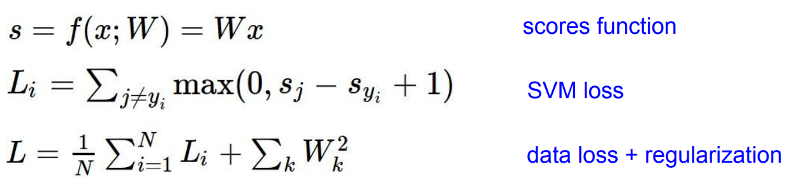
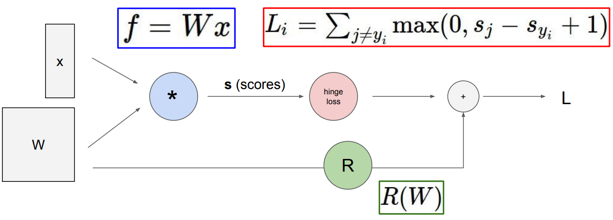
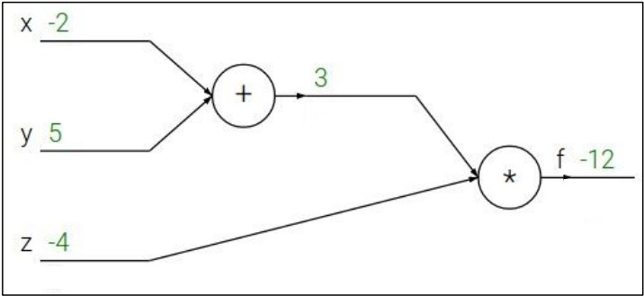
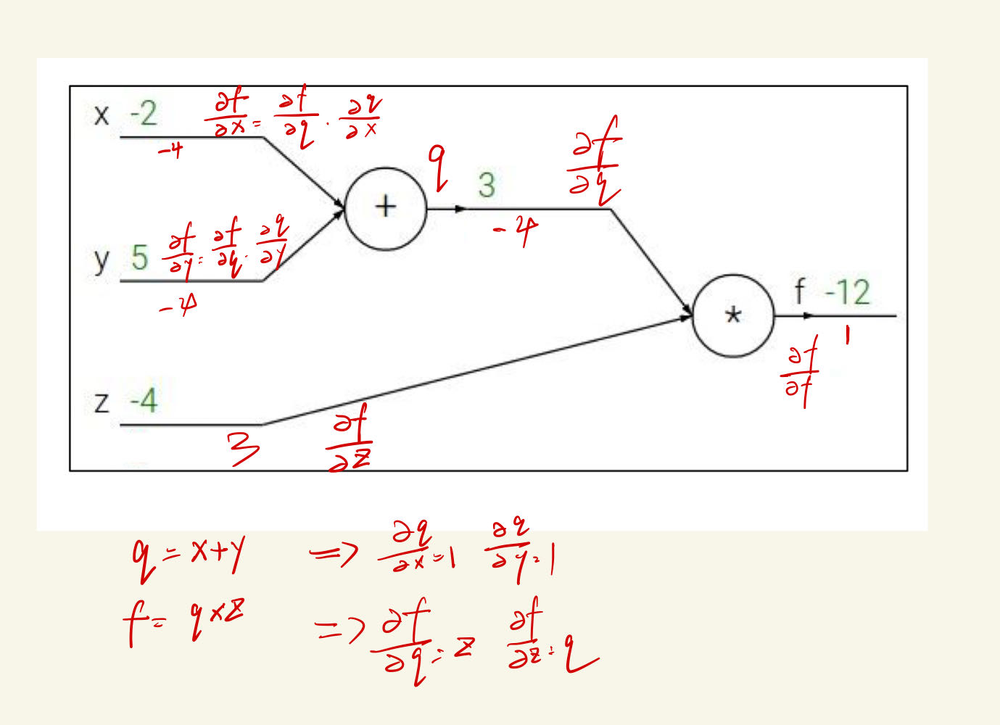
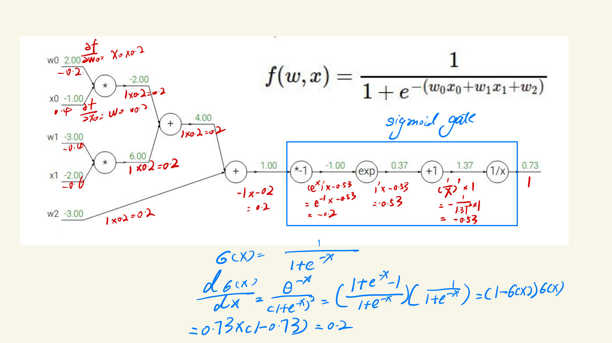
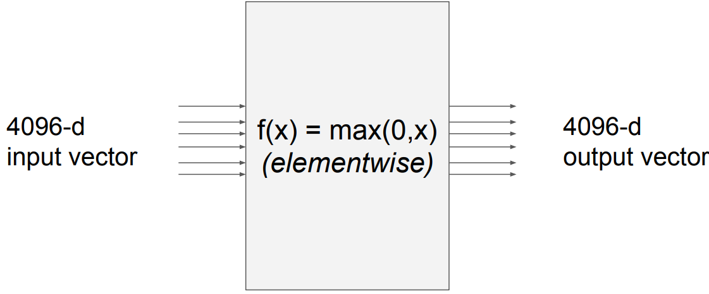
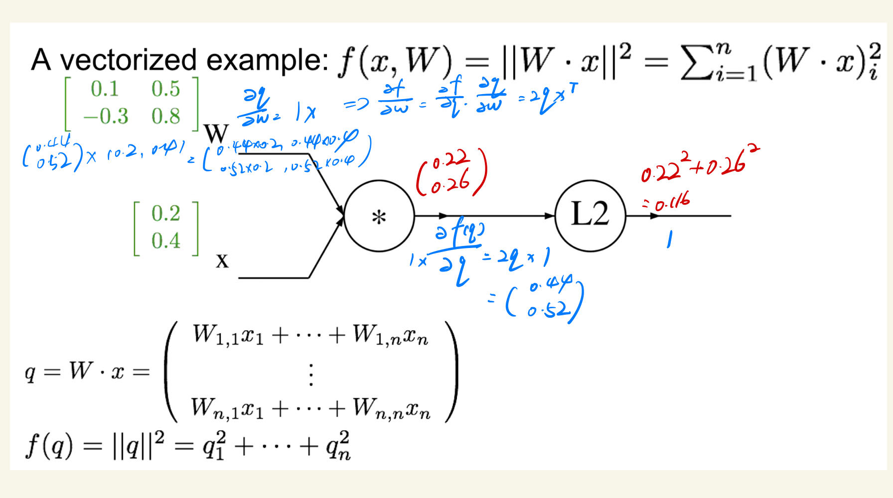

# Backpropagation nd Neural Networks

## What is backpropagation?

书接上回, 现在已经有了目标函数, 损失函数, 正则化; 为了在使用损失函数时让预测值与实际值越来越贴近, 就要让损失函数的值变得越来越小,
因此, 我们需要找到$\frac{\mathrm{d}L}{\mathrm{d}W}$最小的情况(一般是局部最小, 全局最小的情况比较少见)

使用计算图总是能够表现出具体的计算过程, 如下, 先是目标函数(权重), 然后经过SVM损失函数处理, 最终加入一个正则项避免过拟合

**反向传播举例**

$f(x, y, z) = (x + y)z$

首先展示的是正向传播

反向传播计算, 可以看到$f$在$x$方向上的梯度下降为, 出方向的梯度下降乘以入方向的梯度下降, 即$f$在$q$方向的梯度下降乘以$q$在$x$方向的梯度下降,
即$\frac{\partial f}{\partial x} = \frac{\partial f}{\partial q} \times \frac{\partial q}{\partial x}$

另一个关于反向传播计算的示例, 可以看到点和点之间可以进行合并, 连带着实际的梯度下降值也可以进行合并

仔细观察上面几个图, 可以发现几个规律:

1. add gate: distributor, 经过加法点的输入输出值是一样的
2. max gate: router, 输出的梯度是在所有输入梯度中最大的那个
3. mul gate: switcher, 转换器的作用

## Jacobian matrix

Jacobian matrix, 即雅可比矩阵, 是一个矩阵, 矩阵的每一个元素代表的是一个变量对另一个变量的偏导;
前几个图中的对输入的偏导数, 就可以看作是Jacobian matrix

再上图这种情况下, Jacobian Matrix的大小就是4096*4096

下面是Jacobian matrix的计算示例

