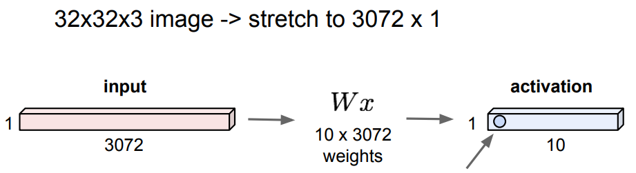
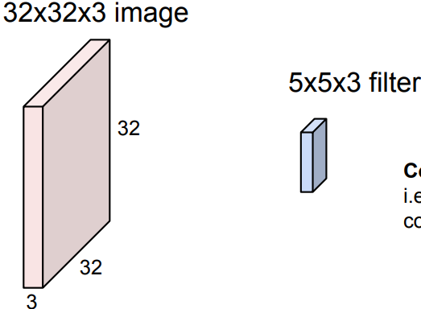
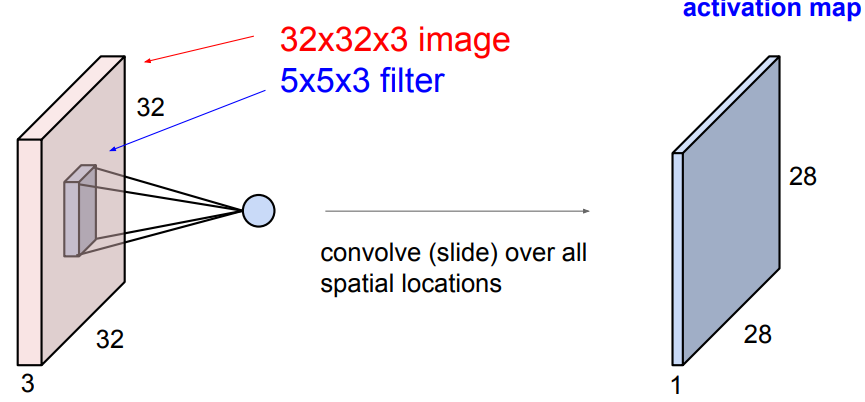
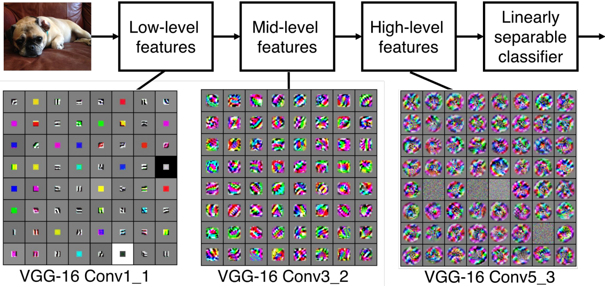
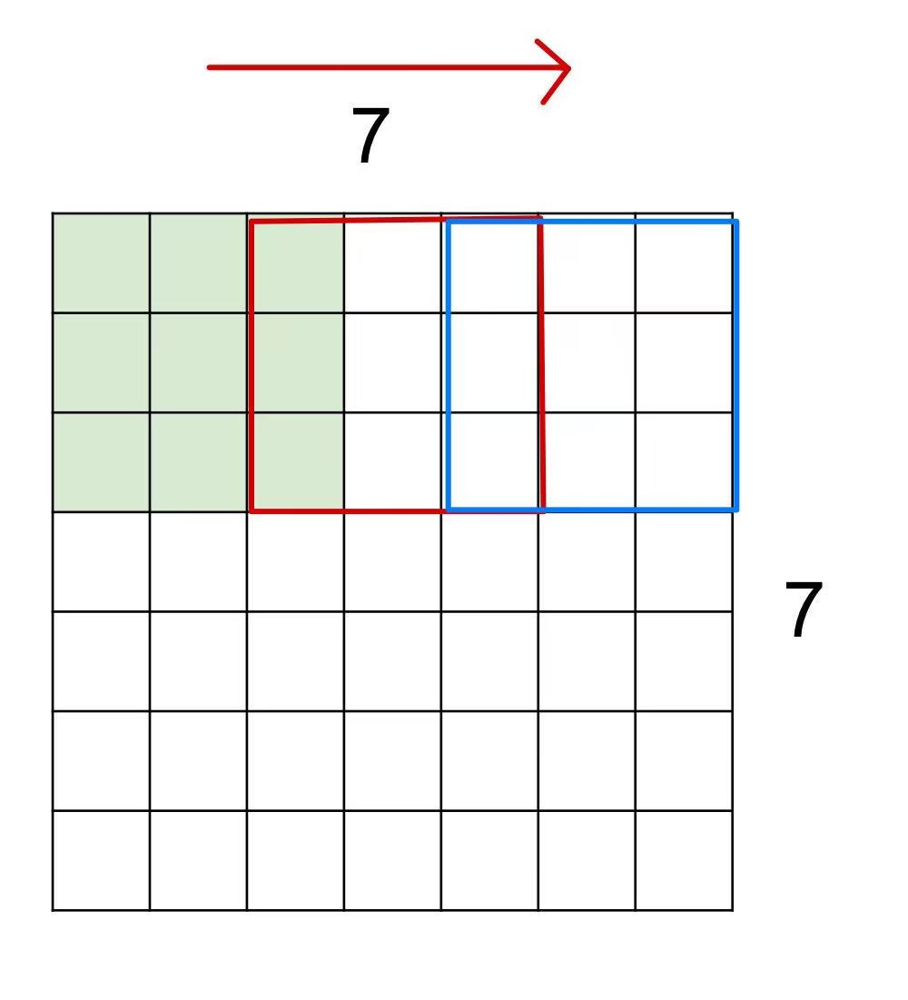
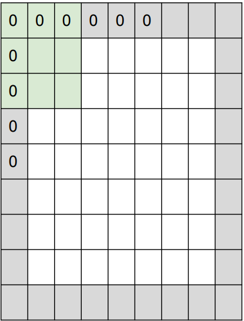
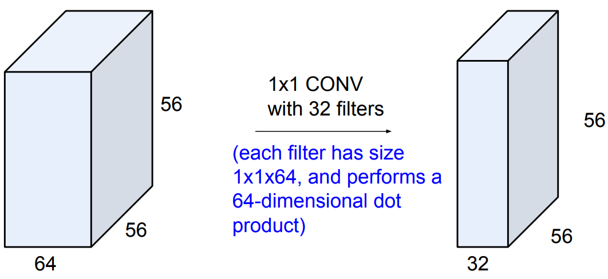
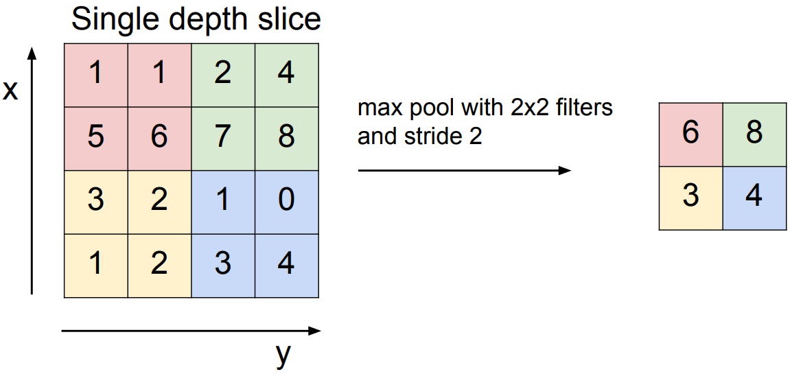

# Convolutional Neural Networks

## 什么卷积层

**全连接层**

全连接层处理步骤如下:

1. 将输入的像素矩阵压缩到一维向量
2. 创建一个权重矩阵, 其大小为`[输入特征向量的长度, 输出特征向量的长度]`
3. 将权重矩阵与输入向量相乘, 得到输出向量

与全连接层相比, 使用卷积层的原因, 就是为了尽可能的保全空间结构, 可以看到全连接层输出跟之前输入的像素矩阵空间改变较大

卷积层的工作流程其实很好理解, `filter`在输入的像素矩阵上进行滑动(按照步长滑动), 滑动过程中, 卷积层会计算`filter`与像素矩阵的点乘

* 输入的像素矩阵: $32\times 32 \times 3$
* 卷积核 `filter`: $5\times 5 \times 3$
* 卷积核在输入的像素矩阵上按照步长进行滑动, 遍历所有的像素点, 计算过程$w^T \times x + b$, 在这个过程中将$w$转换成向量, 5\*5\*3 -> 1\*75
* 最终输入的结果, `depth`就是指用了几个卷积核, 如上图所示, 只用了一个卷积核, 所以输出的结果`depth`就是1
* 可以看到, 经过卷积核处理后, 输入和输出在维度上发生了变化

可以看到, 卷积层最大的作用其实就是不断丰富/提取像素点的特征, 比如边缘, 角落; 不断提取像素点上的特征, 提取到之后, 就可以通过全连接层进行分类了

## 卷积核滑动示例

移动几次, 最终output的宽和高就是几, 比如上图一共移动了三次, 所以最终的输出就是$3 \times 3$

不过如果步长为3, 移动的次数不是整数, 说明该卷积核无法很好与输入的像素矩阵拟合

$Output Size = \frac{N - F}{stride} + 1$, 其中N代表像素矩阵的宽, F代表卷积核的宽

1. 例如步长为1, $\frac{7 - 3}{1} + 1 = 5$
2. 例如步长为2, $\frac{7 - 3}{2} + 1 = 3$
3. 例如步长为3, $\frac{7 - 3}{3} + 1 = 2.33$

前面说过, 使用卷积层的一个最重要的原因就是因为卷积层会尽可能的保证空间结构, 如果还想更进一步的让输出层和输入矩阵尺寸相近, 可以考虑在输入的像素矩阵加0, 这种操作也叫`zero padding`

在原来$7 \times 7$尺寸的像素矩阵加零, 变成$9 \times 9$, 用一个$3 \times 3$的卷积核进行滑动, 步长为1

$Output Size = \frac{7 + 2 - 3}{1} + 1 = 7$

*小问题*

问: 输入一个$32 \times 32 \times 3$尺寸的像素矩阵, 使用10个$5 \times 5$的卷积核进行滑动, 步长为1, zero padding为2, 输出的卷积层尺寸如何???

答: $\frac{32 + 2 \times 2 - 5}{1} + 1 = 32 \times 32 \times 10$; 用几个卷积核, 最终输出的卷积层就有几层

问: 背景同上, 输出的卷积层一种有多少个参数?

答: $(5 \times 5 \times 3 + 1) \times 10 = 760$

其实$1 \times 1$尺寸的卷积核也是很可以的

* 优点: 可以完全的保障输出卷积层的尺寸, 只降低了`depth`
* 缺点: 计算量太大

### 卷积层超参数

1. 卷积核数量: K
2. 单个卷积核的尺寸: F
3. 滑动步长: S
4. zero padding个数: P

$\frac{W - F + 2 \times P}{S} + 1$

## 池化

当输入的像素矩阵, 经过全连接层和卷积层处理后, 需要进行池化, 池化一般紧跟在卷积层后, 有以下的作用:

1. 减小特征图的尺寸, 以降低后续的计算复杂度
2. 减少参数数量, 因为池化会down-sampling, 降低模型复杂度, 防止过拟合
3. 保留关键信息, 使得模型对于平移, 旋转等变换具有一定的不变性
4. 提取特征, 帮助模型提取更抽象和高级的特征

总而言之步骤大概是, 卷积层提取特征图的特征, 全连接层主要用于整合卷积层提取的特征, 并进行分类或回归; 全连接层的作用是将
卷积层提取的特征进行组合和加权

最经典的池化就是`max pooling`, 如上图所示, 选定特定的卷积核和步长, 最终划定四个范围, 在每个范围当中挑最大; 在有些情况下, `max pooling`非常的合适, 比如目标识别任务
