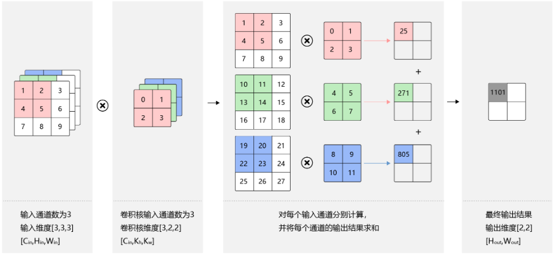
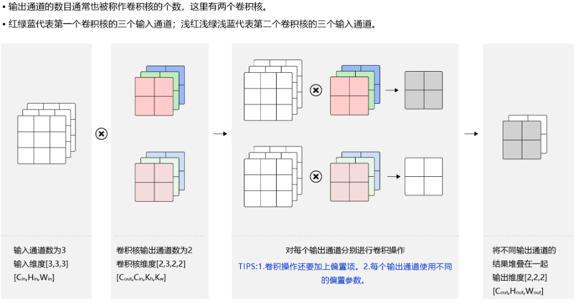
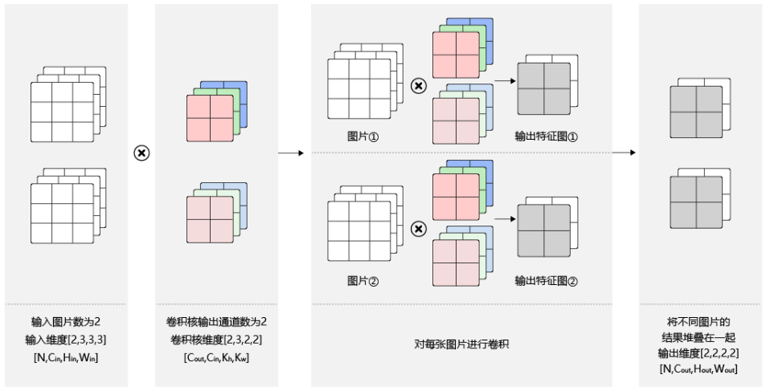
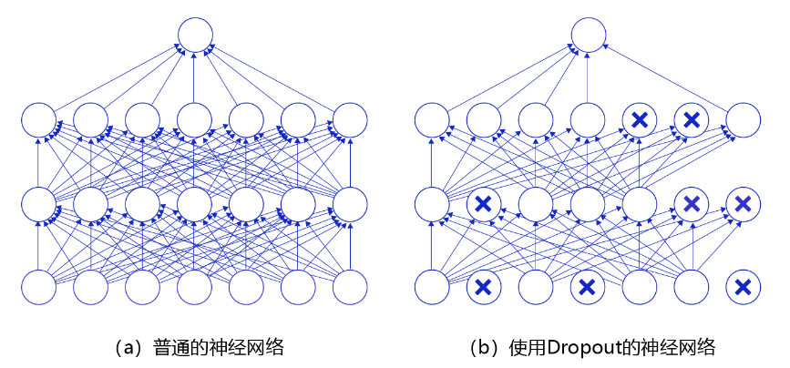
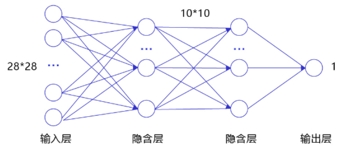
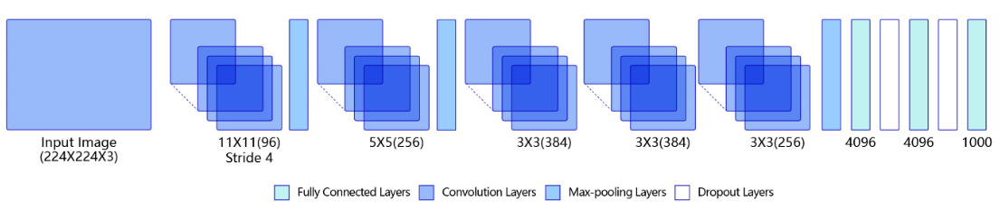

# Convolutional Neural Networks

## 什么卷积层

**全连接层**

全连接层处理步骤如下:

1. 将输入的像素矩阵压缩到一维向量
2. 创建一个权重矩阵, 其大小为`[输入特征向量的长度, 输出特征向量的长度]`
3. 将权重矩阵与输入向量相乘, 得到输出向量

与全连接层相比, 使用卷积层的原因, 就是为了尽可能的保全空间结构, 可以看到全连接层输出跟之前输入的像素矩阵空间改变较大

卷积层的工作流程其实很好理解, `filter`在输入的像素矩阵上进行滑动(按照步长滑动), 滑动过程中, 卷积层会计算`filter`与像素矩阵的点乘

* 输入的像素矩阵: $32\times 32 \times 3$
* 卷积核 `filter`: $5\times 5 \times 3$
* 卷积核在输入的像素矩阵上按照步长进行滑动, 遍历所有的像素点, 计算过程$w^T \times x + b$, 在这个过程中将$w$转换成向量, 5\*5\*3 -> 1\*75
* 最终输入的结果, `depth`就是指用了几个卷积核, 如上图所示, 只用了一个卷积核, 所以输出的结果`depth`就是1
* 可以看到, 经过卷积核处理后, 输入和输出在维度上发生了变化

在卷积神经网络中, 计算范围是在像素点的空间领域内进行的, 卷积核参数的数目要远小于全连接层. 卷积核本身与输入图片大小无关, 它代表了对空间邻域内某种特征模式的提取. 比如, 有些卷积核提取物体边缘特征, 有些卷积核提取物体拐角处的特征, 图像上不同区域共享同一个卷积核.

## 卷积核滑动示例

移动几次, 最终output的宽和高就是几, 比如上图一共移动了三次, 所以最终的输出就是$3 \times 3$

不过如果步长为3, 移动的次数不是整数, 说明该卷积核无法很好与输入的像素矩阵拟合

$Output Size = \frac{N - F}{stride} + 1$, 其中N代表像素矩阵的宽, F代表卷积核的宽

1. 例如步长为1, $\frac{7 - 3}{1} + 1 = 5$
2. 例如步长为2, $\frac{7 - 3}{2} + 1 = 3$
3. 例如步长为3, $\frac{7 - 3}{3} + 1 = 2.33$

前面说过, 使用卷积层的一个最重要的原因就是因为卷积层会尽可能的保证空间结构, 如果还想更进一步的让输出层和输入矩阵尺寸相近, 可以考虑在输入的像素矩阵加0, 这种操作也叫`zero padding`

在原来$7 \times 7$尺寸的像素矩阵加零, 变成$9 \times 9$, 用一个$3 \times 3$的卷积核进行滑动, 步长为1

$Output Size = \frac{7 + 2 - 3}{1} + 1 = 7$

*小问题*

问: 输入一个$32 \times 32 \times 3$尺寸的像素矩阵, 使用10个$5 \times 5$的卷积核进行滑动, 步长为1, zero padding为2, 输出的卷积层尺寸如何???

答: $\frac{32 + 2 \times 2 - 5}{1} + 1 = 32 \times 32 \times 10$; 用几个卷积核, 最终输出的卷积层就有几层

问: 背景同上, 输出的卷积层一种有多少个参数?

答: $(5 \times 5 \times 3 + 1) \times 10 = 760$

其实$1 \times 1$尺寸的卷积核也是很可以的

* 优点: 可以完全的保障输出卷积层的尺寸, 只降低了`depth`
* 缺点: 计算量太大

### 卷积层超参数

1. 卷积核数量: K
2. 单个卷积核的尺寸: F
3. 滑动步长: S
4. zero padding个数: P

$\frac{W - F + 2 \times P}{S} + 1$

## 多输入通道, 多输出通道和批量操作

对于彩色图片由RGB三个通道, 需要处理多输入通道的场景. 输出特征图往往也会具有多个通道, 而且在神经网络的计算中常常是把一个批次的样本放在一起计算, 所以卷积算子需要具有批量处理多输入和多输出通道数据的功能

### 多输入通道场景

假设输入图片的通道是$C_{in}$, 输入数据的形状是$C_{in} \times H_{in} \times W_{in}$

1. 对每个通道分别设计一个二维数组作为卷积核, 卷积核数组的形状是$C_{in} \times k_{h} \times k_{w}$
2. 对任一通道$C_{in}  \in [0, C_{in})$, 分别用大小为$k_h \times k_w$在大小为$H_{in} \times W_{in}$的二维数组上做卷积
3. 将这$C_{in}$个通道的计算结果相加, 得到的是一个形状为$H_{out} \times W_{out}$

### 多输出通道场景

假设输出通道数是$C_{out}$, 这时我们需要设计$C_{out}$个维度为$C_{in} \times k_h \times k_w$的卷积核, 卷积核数组的维度是$C_{out} \times C_{in} \times k_{h} \times k_{w}$

1. 对任一输出通道$c_{out} \in [0, C_{out})$, 分别使用上面描述的形状为$C_{in} \times k_h \times k_w$的卷积核对输入图片做卷积
2. 将这$C_{out}$个形状为$H_{out} \times W_{out}$的二维数组拼接在一起, 形成维度为$C_{out} \times H_{out} \times W_{out}$

**通常将卷积核的输出通道数叫做卷积核的个数**

### 批量操作

卷积神经网络计算中, 通常将多个样本放在一起作为`mini-batch`进行批量操作, 即输入数据的维度是$N \times C_{in} \times H_{in} \times W_{in}$, 由于会对每张图片使用同样的卷积核进行卷积操作, 卷积核的维度与上面多输出通道的情况一样, 仍然是$C_{out} \times C_{in} \times k_h \times k_w$,
输出特征图的维度是$N \times C_{out} \times H_{out} \times W_{out}$

## 池化

当输入的像素矩阵, 经过全连接层和卷积层处理后, 需要进行池化, 池化一般紧跟在卷积层后, 有以下的作用:

1. 减小特征图的尺寸, 以降低后续的计算复杂度
2. 减少参数数量, 因为池化会down-sampling, 降低模型复杂度, 防止过拟合
3. 保留关键信息, 使得模型对于平移, 旋转等变换具有一定的不变性
4. 提取特征, 帮助模型提取更抽象和高级的特征

总而言之步骤大概是, 卷积层提取特征图的特征, 全连接层主要用于整合卷积层提取的特征, 并进行分类或回归; 全连接层的作用是将
卷积层提取的特征进行组合和加权

池化一般是使用某一位置的相邻输出的总体统计特征代替网络在该位置的输出, 其好处是当输入数据做出少量平移时, 经过池化函数后的大多数输出还能保持不变. 比如当识别一张图像是否是人脸时, 需要知道人脸左边有一只眼睛, 右边也有一只眼睛, 而不需要知道眼睛的精确位置, 这时候通过池化某一片
区域的像素点来得到总体统计特征会显得很有用. 由于池化后特征图会变得更小, 如果后面连接的是全连接层, 能有效的减小神经元的个数, 节省存储空间并提高计算效率

最经典的池化就是`max pooling`, 如上图所示, 选定特定的卷积核和步长, 最终划定四个范围, 在每个范围当中挑最大; 在有些情况下, `max pooling`非常的合适, 比如目标识别任务

## 批归一化 Batch Normalization

批归一化的使用目的是对神经网络中间层的输出进行标准化处理, 使得中间层的输出更稳定; 通常会对神经网络的数据进行*标准化处理*, 处理后的样本数据集满足均值为0, 方差为1的分布, 这是因为当输入数据的分布比较固定时, 有利于算法的稳定和收敛.
但是对于深度网络来说, 由于参数是不断更新的, 即使输入数据已经做过标准化处理, 但是对于比较靠后的那些层, 其接收到的输入仍然是剧烈变化的, 通常会导致数值不稳定, 模型很难收敛, 优点如下:
1. 使学习快速进行 (能够使用较大的学习率)
2. 降低模型对初始值的敏感性
3. 从一定程序能抑制拟合

第一步, 计算`mini-batch`内样本的均值

$\mu_B \leftarrow \frac{1}{m} \sum_{i=1}^m x^{(i)}$

其中$x^{(i)}$表示`mini-batch`中的第$i$个样本

例如输入`mini-batch`包含3个样本, 每个样本有2个特征, 分别为:

$x^{(1)} = (1, 2), x^{(2)} = (3, 6), x^{(3)} = (5, 10)$

* $\mu_{B0} = \frac {1 + 3 + 5}{3} = 3$
* $\mu_{B1} = \frac {2 + 6 + 10}{3} = 6$

则样本均值为$\mu_B = (\mu_{B0}, \mu_{B1}) = (3, 6)$

第二步, 计算`mini-batch`内样本的方差

$\sigma_B^2 \leftarrow \frac{1}{m} \sum_{i=1}^m\left(x^{(i)}-\mu_B\right)^2$

上面的计算公式先计算一个批次内样本的均值$\mu_B$和方差$\sigma_B^2$, 然后再对输入数据做归一化, 将其调整成为均值为0, 方差为1的分布

对于上面给定的$x^{(1)}, x^{(2)}, x^{(3)}$, 可以计算出每个特征对应的方差

* $\sigma_{B0} = \frac {8}{3}$
* $\sigma_{B1} = \frac {32}{3}$

则样本方差为$\sigma_B^2 = (\sigma_{B0}^2, \sigma_{B1}^2) = (\frac {8}{3}, \frac {32}{3})$

第三步, 计算标准化后的输出
$\hat{x} _{(i)} \leftarrow \frac{x^{(i)} - \mu_B}{\sqrt{(\sigma_B^2 + \epsilon )} } $, 其中$\epsilon$是一个微小值, 其主要作用是为了防止分母为0

## 丢弃法 Dropout

丢弃法是深度学习中一种常用的*抑制过拟合*的方法, 其做法是在神经网络学习过程中, *随机*删除一部分神经元. 训练时, 随机选出一部分神经元, 将其置0, 这些神经元不对外传递信号

)

## 全连接神经网络与卷积神经网络

### 全连接神经网络

经典的全连接神经网络来包含四层网络, 输入层, 两个隐含层和输出层

1. 输入层: 将数据输入给神经网络, 例如输入层的尺度为28*28的像素值, 输入层通常会将像素矩阵转换成为1维向量
2. 隐含层: 增加网络深度和复杂度, 隐含层的节点数是可以调整的, 节点数越多代表神经网络的表示能力越强, 参数量也越多, 比如说隐含层是10*10结构, 通常隐含层会比输入层尺度要小, 这是因为要对关键信息进行抽取, 最常见的激活函数就是`sigmoid`函数
3. 输出层: 输出网络计算结果, 输出层节点一般是固定的, 如果是回归问题, 则节点数量为需要回归的数字数量, 如果是分类问题, 则节点数量为分类标签的数量

问题:

1. 输入数据的空间信息被丢失, 空间上相邻的像素点往往具有相似的RGB值, RGB的各个通道之间的数据通常相互关联. 但是转化成1维向量时, 这些信息是被丢掉的
2. 模型参数过多, 容易发生过拟合; 例如每个像素点都跟所有输出的神经元相连接, 当图片尺寸变大时, 输入神经元的个数会按图片尺寸的平方增大, 导致模型参数过多, 产生过拟合

正因为全连接神经网络有的这些问题, 所以才引入卷积神经网络进行特征提取, 既能提取到相邻像素点之间的特征模式, 又能保证参数的个数不随图片尺寸变化

### 卷积神经网络

全连接神经网络, 例如中间的隐含层抽取了关键信息, 但代价是丢失了图像像素中的关键信息. 而卷积神经网络避免了这个问题, 保留原始的像素间空间信息

典型的神经网络由多个卷积层和池化层组成, 其中卷积层对输入进行扫描以提取更抽象的特征表示, 池化层对这些特征进行过滤, 保留最关键的特征信息
