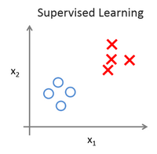
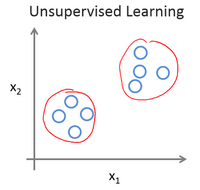
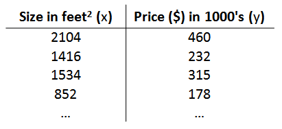

# Week 1 笔记

本节包含内容

> * 监督学习和无监督学习简介
> * 单变量的线性回归
> * 代价函数

## 监督学习和无监督学习简介

监督学习, 在训练集中是会给出label *(Right Answer)*, 比如下图预测房价; 训练集中会给出特定房屋面积下实际的价格;
根据训练集训练出来的模型会在测试集中预测出对应的预测价格

下图蓝线为预测曲线, 可以看出预测值是**连续**的，所以这是一个回归模型

这也是一种监督学习，label不是连续，而是离散的, 如下图预测癌症是否良性, 所以这是一个分类模型

分类模型同样可以处理feature较多的模型, 一般会采取支持向量机

以下两图是监督与非监督的区别, 可以看出非监督模型中训练集是不存在label的, 像第二个图, 无监督学习模型
能够判断出有两个不同的数据组

最常见的例子就是Google新闻, 每天在大量不同的新闻中根据主题进行自动分类, 这就是无监督学习模型的实际例子之一

## 单变量线性规划

### 术语

$m$ 表示训练集中训练样本的数量

$x$ 表示特征/输入变量

$y$ 表示label/输出变量

$(x, y)$ 表示训练集中的实例

$(x^{(i)}, y^{(i)})$ 表示第i个训练样本

在这里我们将从x到y的映射称之为h, 则表达式为$h_{\theta}(x)=\theta_{0}+\theta_{1}x$, 因为只有一个x, 所以是单变量线性回归问题

### 代价函数

代价函数是一种衡量预测值和实际值的参考指标, 由代价函数计算出来的值越小, 则证明预测值越准确

那么在这个线性回归函数中$h_{\theta}(x)=\theta_{0}+\theta_{1}x$, 只有改变$\theta_{0}$和$\theta_{1}$才能改变预测值

代价函数: $J \left( \theta_0, \theta_1 \right) = \frac{1}{2m}\sum\limits_{i=1}^m \left( h_{\theta}(x^{(i)})-y^{(i)} \right)^{2}$

当代价函数最小时->误差最小->预测效果最好
