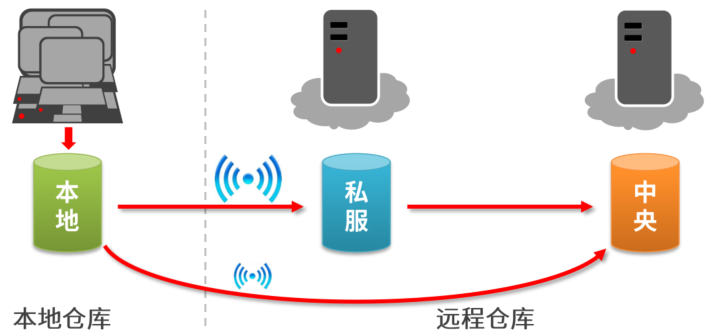

# Maven简介

## Maven是干什么用的

* `maven`本质上是一个项目管理工具(jar包)，将项目开发和管理过程抽象成一个项目对象模型(POM)
* `POM` (project object model): 项目对象模型;通过加载`pom.xml`文件，加载出项目对象模型

## Maven作用

* 项目构建
* 依赖管理：管理`jar`包，处理`jar`包内的冲突
* 统一开发结构：提供标准的、统一的项目结构

## Maven下载

[Maven官网](https://maven.apache.org/)

需要配好`JAVA_HOME`, `MAVEN_HOME`环境变量；后在命令行中输入`mvn -v`以验证是否安装成功

## Maven基本概念



本地的`jar`包，一般是从云端上来的，也就是中央仓库download下来；现实生活中存在一个私服，例如国内的镜像资源，也可以从私服中download下来

坐标：`Maven`中的坐标用于描述仓库中资源的位置

坐标的构成：

1. `groupId`: 定义当前`Maven`项目隶属组织名称(通常是域名反写，例如: `org.mybatis`)
2. `artifactId`：定义当前`Maven`项目名称(通常是模块名称, 例如：`CRM`, `SMS`)
3. `version`：定义当前项目版本号

[Maven仓库坐标](https://mvnrepository.com/)

作用：使用唯一标识，唯一性定位资源位置，通过该标识可以将资源的识别与下载工作交由机器完成

### Maven仓库的配置

在`/conf/settings.xml`中修改特定参数

`<localRepository>/path/to/local/repo</localRepository>`安装需求，将你想存放的新路径替换到这个参数上

为了提高下载速度，将国外的中央仓库换成阿里的镜像

```xml
<mirror>
      <id>mirrorId</id>
      <mirrorOf>repositoryId</mirrorOf>
      <name>Human Readable Name for this Mirror.</name>
      <url>http://my.repository.com/repo/path</url>
</mirror>
```

```xml
<mirror>
      <id>nexus-aliyun</id>
      <mirrorOf>central</mirrorOf>
      <name>Nexus aliyun</name>
      <url>http://maven.aliyun.com/nexus/content/groups/public</url>
</mirror>
```

刚才我们配的`setting`是全局`setting`，全局定义了当前计算机中`Maven`的公共配置
还有一个用户`setting`, 在`C:\Users\Fredrick\.m2\repository\`目录下
