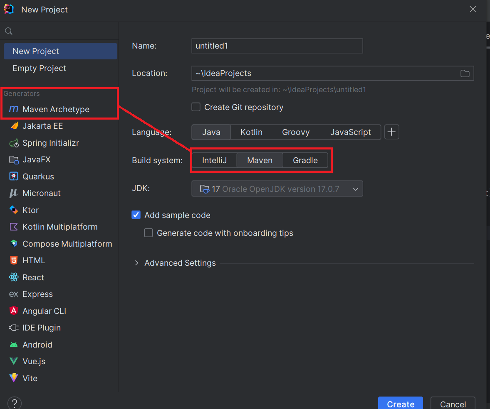
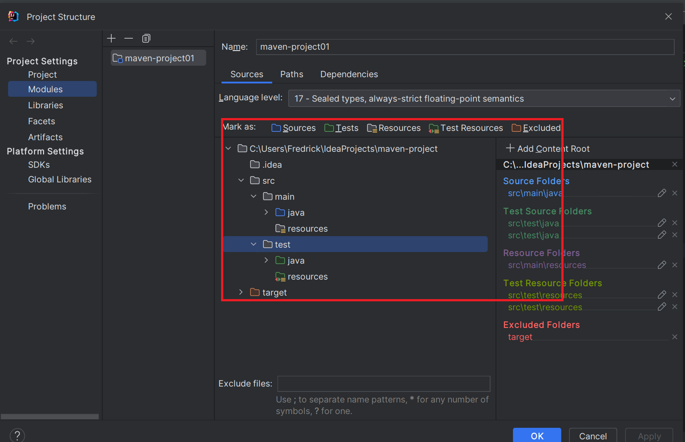

# 构建Maven项目

## 手动构建Maven项目

使用`Maven`构建的项目结构，都大抵如此

```xml
└─project-java
        │  pom.xml
        │
        ├─src
        │  ├─main
        │  │  ├─java
        │  │  │  └─com
        │  │  │      └─ytq
        │  │  │              Demo.java
        │  │  │
        │  │  └─resources
        │  └─test
        │      ├─java
        │      │  └─com
        │      │      └─ytq
        │      │              DemoTest.java
        │      │
        │      └─resources
        └─target
        │  project-java-1.0-SNAPSHOT.jar
        │
        ├─classes
        │  └─com
        │      └─ytq
        │              Demo.class
        │
        ├─generated-sources
        │  └─annotations
        ├─generated-test-sources
        │  └─test-annotations
        ├─maven-archiver
        │      pom.properties
        │
        ├─maven-status
        │  └─maven-compiler-plugin
        │      ├─compile
        │      │  └─default-compile
        │      │          createdFiles.lst
        │      │          inputFiles.lst
        │      │
        │      └─testCompile
        │          └─default-testCompile
        │                  createdFiles.lst
        │                  inputFiles.lst
        │
        ├─surefire-reports
        │      com.ytq.DemoTest.txt
        │      TEST-com.ytq.DemoTest.xml
        │
        └─test-classes
        └─com
        └─ytq
        DemoTest.class
```

在`src`同目录下，创建一个`settings.xml`文件，进行配置

```xml
<groupId>com.ytq</groupId> # 目录名
<artifactId>project-java</artifactId> # 项目名
<version>1.0-SNAPSHOT</version>
```

构建依赖，引入`junit`包

```xml
<dependencies>
    <dependency>
        <groupId>junit</groupId>
        <artifactId>junit</artifactId>
        <version>4.12</version>
    </dependency>
</dependencies>
```

### Maven常用命令

* **注意：可以一次执行多个命令，使用空格隔开**
* `mvn compile` 编译
* `mvn clean` 清理
* `mvn test` 测试
* `mvn package` 打包
* `mvn install` 安装到本地仓库

## 插件创建Maven项目

示例

```xml
mvn archetype:generate -DgroupId=com.ytq -DartifactId=project-java02 -DarchetypeArtifactId=maven-archetype-quickstart -Dversion=0.0.1-snapshot -DinteractiveMode=false
```

## 使用IDEA自动生成Maven项目

### 配置Maven项目

新版本的`IDEA`无法像以前一样，单独的创建`maven`项目，不过可以通过构建`Java`项目来构建`maven`项目



在`Project Structure`中编辑属性



### 原型构建Java项目

直接使用`IDEA`中的`maven archetype`, `quickstart`模板

## Maven实战一，tomcat插件安装与web工程启动

详情请看[此项目](./Maven_project1/maven-project03)

添加`tomcat`插件

```xml
<build>
  <!--设置插件-->
    <plugins>
      <!--具体的插件配置-->
      <plugin>
        <groupId>org.apache.tomcat.maven</groupId>
        <artifactId>tomcat7-maven-plugin</artifactId>
        <version>2.2</version>
        <!--在configuration中配置端口号和路径-->
        <configuration>
          <port>1453</port>
          <path>/</path>
        </configuration>
      </plugin>
    </plugins>
    <finalName>maven-project03</finalName>
</build>
```
