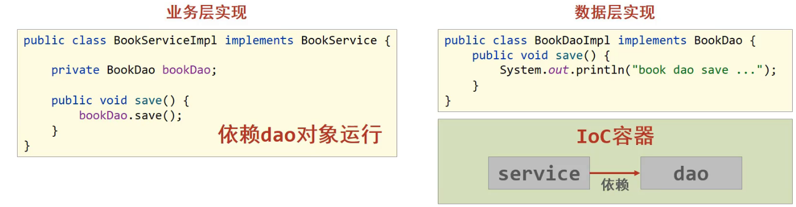

# Spring基础概念

**本节目标**

> * Spring基本架构扫盲
> * IoC和DI的基本概念

下面展示的是经典的Spring架构图

1. Core Container: 这个模块是Spring最核心的模块，其他模块均依赖于此
2. AOP层: 面向切面编程，目的是在不改变原有代码的前提下增强功能
3. Data Access/Integration
   1. Data Access: 数据访问，Spring全家桶有对数据访问的具体实现功能
   2. Data Integration: 数据集成，Spring支持整合其他数据层的解决方案，例如Mybatis
   3. Transactions: 事务，事务管理是Spring AOP的一个具体实现

## Spring框架要解决的核心问题

假设一个项目中存在两个层，业务层与数据层，即Service和Dao

往往业务层需要用到数据层的方法，因此肯定要在业务层中需要声明数据层的对象

`private BookDao bookDao = new BookDaoImpl();`

但如果数据层的具体实现类发生变化，在业务层中声明的数据层的对象也需要进行修改; 需要重复 compile -> test-compile -> test -> package -> deploy

这样就会造成一个严重的问题,  代码耦合度高

## IoC 控制反转

想摆脱耦合度高的问题，就不能允许主动使用new对象，而是应该让外部产生对象，这其实就是IoC的核心思想

Spring和IoC之间的关系是什么呢？

1. Spring框架有对IoC的具体实现
2. Spring提供了*IoC容器*，用来充当产生对象的*外部*

IoC容器的作用以及内部存放的是什么呢？

1. IoC容器负责对象的创建、初始化等操作，其中包含了数据层和业务层的类对象
2. 被创建和管理的对象在IoC容器中就是bean对象

当把Service和Dao类对象放到IoC容器中后，程序并不能直接运行；因为在IoC容器中的Service和Dao类对象没有任何关系

## DI 依赖注入

在IoC容器中建立bean对象之间的关系，就是依赖注入

1. 以前业务层要使用数据层的类对象，需要在业务层中new一个对象
2. 现在不需要new了，直接靠外部注入即可
